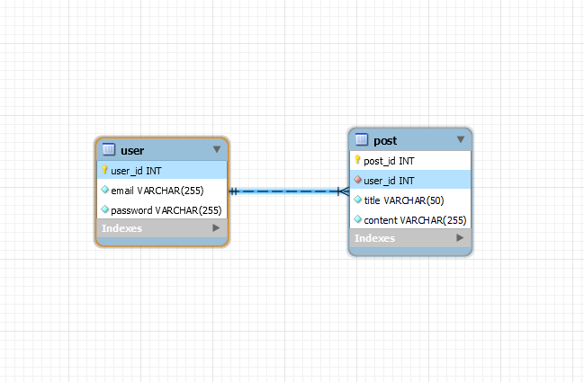

## 원티드 프리온보딩 백엔드 인턴쉽 선발 과제

### 🌈목차

1. [지원자 성명](#1-지원자-성명)
2. [애플리케이션 실행 방법](#2-애플리케이션-실행-방법)
3. [데이터베이스 테이블 구조](#데이터베이스-테이블-구조)
4. [구현한 API의 동작을 촬영한 데모 영상 링크](#구현한-api의-동작을-촬영한-데모-영상-링크)
5. [구현 방법 및 이유에 대한 간략한 설명](#구현-방법-및-이유에-대한-간략한-설명)
6. [API 명세(request/response 포함)](#api-명세requestresponse-포함)
7. [가산점 추가 기능](#가산점-추가-기능)

## 1. 지원자 성명

### 박 지 원

## 2. 애플리케이션 실행 방법

### 1. AWS EC2 배포 주소

💻 http://43.200.110.0/

### 2. 로컬 실행

```bash
git clone https://github.com/okonomiyakki/wanted-pre-onboarding-backend.git

cd wanted-pre-onboarding-backend

touch .env

npm install

npm run dev
```

- .env 파일 구성 예시

```bash
# 경로 | wanted-pre-onboarding-backend/.env


BCRYPT_SALT_ROUNDS=${BCRYPT_SALT_ROUNDS}

PORT=${PORT}

DB_HOST=${DB_HOST}
DB_PORT=${DB_HOST}
DB_NAME=${DB_NAME}
DB_USERNAME=${DB_USERNAME}
DB_PASSWORD=${DB_PASSWORD}

JWT_SECRET_KEY_LENGTH=${JWT_SECRET_KEY_LENGTH}

ACCESS_TOKEN_SECRET=${ACCESS_TOKEN_SECRET}
ACCESS_TOKEN_EXPIRES_IN=${ACCESS_TOKEN_EXPIRES_IN}

REFRESH_TOKEN_SECRET=${REFRESH_TOKEN_SECRET}
REFRESH_TOKEN_EXPIRES_IN=${REFRESH_TOKEN_EXPIRES_IN}
```

### 3. 엔드포인트 호출

- USER API

  - 회원가입
    ```
    POST /api/v1/users/signup
    ```
    ```bash
    curl --location --request POST 'http://43.200.110.0/api/v1/users/signup' \
    --header 'Content-Type: application/json' \
    --data-raw '{
        "email": "test@gmail.com",
        "password": "test1234"
    }'
    ```
  - 로그인
    ```
    POST /api/v1/users/login
    ```
    ```bash
    curl --location --request POST 'http://43.200.110.0/api/v1/users/login' \
    --header 'Content-Type: application/json' \
    --data-raw '{
        "email": "test@gmail.com",
        "password": "test1234"
    }'
    ```

- POST API

  - 게시글 등록
    ```
    POST /api/v1/posts
    ```
    ```bash
    curl --location --request POST 'http://43.200.110.0/api/v1/posts' \
    --header 'Content-Type: application/json' \
    --header 'Authorization: Bearer ${ACCESS_TOKEN}' \
    --header 'Cookie: RefreshToken= ${REFRESH_TOKEN}' \
    --data '{
        "title": "example title",
        "content": "example content"
    }'
    ```
  - 게시글 수정

    ```
    PATCH /api/v1/posts/:id
    ```

    ```bash
    curl --location --request PATCH 'http://43.200.110.0/api/v1/posts/:id' \
    --header 'Content-Type: application/json' \
    --header 'Authorization: Bearer ${ACCESS_TOKEN}' \
    --header 'Cookie: RefreshToken= ${REFRESH_TOKEN}' \
    --data '{
        "title": "edit example title",
        "content": "edit example content"
    }'
    ```

  - 게시글 삭제

    ```
    DELETE /api/v1/posts/:id
    ```

    ```bash
    curl --location --request DELETE 'http://43.200.110.0/api/v1/posts/:id' \
    --header 'Content-Type: application/json' \
    --header 'Authorization: Bearer ${ACCESS_TOKEN}' \
    --header 'Cookie: RefreshToken= ${REFRESH_TOKEN}'
    ```

  - 게시글 전체 조회

    ```
    GET /api/v1/posts?page=&size=
    ```

    ```bash
    curl --location --request GET 'http://43.200.110.0/api/v1/posts?page=&size='
    ```

  - 게시글 단일 조회
    ```
    GET /api/v1/posts/:id
    ```
    ```bash
    curl --location --request GET 'http://43.200.110.0/api/v1/posts/:id'
    ```

## 데이터베이스 테이블 구조

### 1. ERD



- USER TABLE

  - 서비스 사용자의 회원 정보를 저장합니다.
  - usre_id : AUTO INCREMENT 속성을 갖는 USER 테이블의 고유 식별자(PK) 입니다.
  - email : UNIQE 속성을 갖는 회원의 이메일이며, 최대길이는 255자 입니다.
  - password : 해싱처리된 회원의 비밀번호이며, 최대 255자까지 저장됩니다.

- POST TABLE
  - 서비스의 사용자가 작성한 게시글 정보를 저장합니다.
  - post_id : AUTO INCREMENT 속성을 갖는 POST 테이블의 고유 식별자(PK) 입니다.
  - user_id : USER 테이블의 고유 식별자를 참조하는 외래키(FK) 입니다.
  - title : 게시글의 제목이며, 최대 길이는 50자 입니다.
  - content : 게시글의 본문이며, 최대 길이는 255자 입니다.

> user_id 컬럼으로 원투매니 관계가 형성되어 있으며, 사용자 한명이 게시글 여러개를 작성합니다.

## 구현한 API의 동작을 촬영한 데모 영상 링크

## 구현 방법 및 이유에 대한 간략한 설명

1. src 하위 폴더 구조

   - configs : db 풀링과 env 커넥션을 담당합니다.
   - controllers : API의 엔드포인트 입니다.
   - dtos : DTO 패턴이 사용된 클래스 입니다.
   - middlewares: 토큰 인증 및 인가, 그리고 에러처리 미들웨어 입니다.
   - validators : 유효성 검사 미들웨어 입니다.
   - public: ERD.png 이미지 파일이 존재합니다.
   - repositories : 작성된 raw 쿼리문으로 db와 linking 합니다.
   - routes : API의 라우터 입니다.
   - services : API의 비지니스 로직을 담당합니다.
   - types : TS 타입을 선언합니다.
   - utils : 재사용함수 로직들이 존재합니다.
   - app.ts : 서버 실행 파일입니다.

2. JWT 토큰 인증 방식

   - 서버에서 해당 세션 정보를 저장할 필요가 없고, 사용자가 많은 서비스의 경우 DB 조회를 줄일 수 있다고 생각하여 선택하였습니다.
     > 도메인을 구입하는 환경이 안되어 HTTPS 적용을 하지 못했지만 안전한 토큰 전송에 꼭 필요하다는 부분은 알고 있습니다.

3. 게시글 작성자만 수정 및 삭제 가능 기능

   - JWT 토큰 발급 시 PAYLOAD에 회원의 고유 식별자(user_id)를 추가하여 로그인 이후 사용자가 본인이 작성한 게시글을 수정 및 삭제 행위를 할때,

     해당 회원의 user_id를 별도로 받아 조회하지 않고, JWT 토큰에 담겨있는 user_id를 통해 매핑되는 게시글만 가능하도록 구현하였습니다.

     > 게시글 수정 및 삭제 시 추가로 해당 회원이 작성한 게시글 여부를 확인하는 validation 로직 사용을 줄일 수 있었고, 결과적으로 DB 조회를 줄여 네트워크 비용을 감소시키고자 하였습니다.

4. JWT 토큰 자동 갱신

   - 서비스에서 사용자가 로그인에 성공하면 ACCESS TOKEN이 발급되는데, JWT 토큰 인증 방식인 만큼 만료기간을 짧게 설정하였습니다. 하지만 이를 만료될 때 마다 재발급하는 API를 만들어 요청시키는 것 보다 자동으로 갱신하는 로직을 서버(미들웨어)에서 구현하고자 하였습니다.

     따라서 ACCESS TOKEN의 만료기간만 소요되었을때, 로그인 시 함께 발급되는 REFRESH TOKEN으로 만료된 ACCESS TOKEN과의 유효성을 확인하고 자동으로 다시 새로운 ACCESS TOKEN을 인가하여 불필요한 네트워크 콜을 줄였습니다.

     > 로그인 성공 시, Response Body로 ACCESS TOKEN이 발급, cookie로 REFRESH TOKEN이 발급됩니다. 해당 서비스에서의 만료시간은 ACCESS TOKEN이 1시간, REFRESH TOKEN이 2주로 설정되어있습니다. REFRESH TOKEN 만료의 경우에는 '재로그인 요구' 에러 메시지를 반환합니다.

5. BCRYPT 비밀번호 해싱
   - SALT ROUNDS값으로 해싱 반복 횟수를 조정하여 느린 해싱을 사용할 수 있었고, 사용자의 비밀번호를 안전하게 저장하기 위해 선택하였습니다.

## API 명세(request/response 포함)

## 가산점 추가 기능
